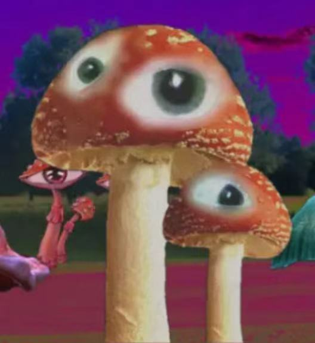

 <a href="README.md">主页</a>
       <a href="./level.md">层级</a>
       <a href="Entity.md">实体</a>
       <a href="#">物品</a>
       <a href="QQ.jpeg">QQ社区</a>
       <a href="DY.jpeg">抖音号</a>

# 实体 : C-01 - 凝视菌

| 项目 | 内容 |
| :--- | :--- |
| **实体编号** | C-01 |
| **栖息地** | Level 391的草地、废弃游乐场及郊区庭院，偏好潮湿、有童年记忆关联的区域 |

［一位流浪者在Level 11摄下的一幅凝视菌照片］

描述：
「凝视菌」是Level 391中最常见的实体之一，常以巨型毒蘑菇形态出现，菌盖中央嵌有一只人类眼球，会持续注视周围的流浪者。它们是层级“真实性”拷问的具象化符号，也是梦核美学中不安感的核心来源。

行为：

* 通常保持静止，仅通过眼球转动追踪目标，不会主动发起攻击。

* 当流浪者长时间直视其眼球时，会产生强烈的眩晕与自我怀疑，脑海中反复回荡“are you real?”的低语。

* 若流浪者表现出恐惧或试图破坏菌盖，它们会释放出致幻孢子，使目标陷入更强烈的梦境循环。

生物学特征：

* 菌盖呈鲜艳的红色，带有白色斑点，与现实中的毒蝇伞高度相似，但尺寸可达1.5米以上。

* 中央眼球的虹膜颜色随机，瞳孔会随光线变化收缩，部分个体的眼球可独立转动，甚至流出透明黏液。

* 菌柄内部为中空结构，充满类似脑脊液的液体，触摸时会产生冰冷的黏腻感。

发现记录：
首次记录来自流浪者M-27。他在Level 391的郊区街道上发现了第一株「凝视菌」，起初以为是童年记忆中的蘑菇道具，直到它的眼球突然转动并与他对视。M-27在报告中写道：“它的眼神像我已故的祖母，却又带着一种不属于人类的冷漠。我花了三个小时才从它的注视中挣脱，醒来时发现自己躺在同一片草地上，而它已经消失了。”

附加信息：
部分流浪者声称，「凝视菌」的眼球中倒映着他们童年时的创伤场景。有学者推测，这些实体是层级对人类记忆的扭曲投射。

行为准则：
应当：

* 保持至少5米的距离，避免直视其眼球。

* 若不慎被注视，立即用强光照射菌盖，可暂时中断其影响。
不应：

* 尝试触摸或破坏菌盖，这会触发孢子释放。

* 在其附近停留超过10分钟，否则可能陷入永久性的自我怀疑。
